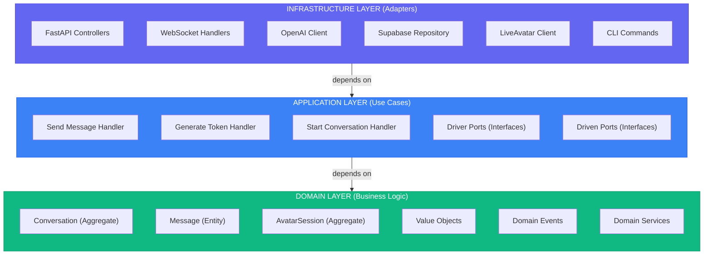
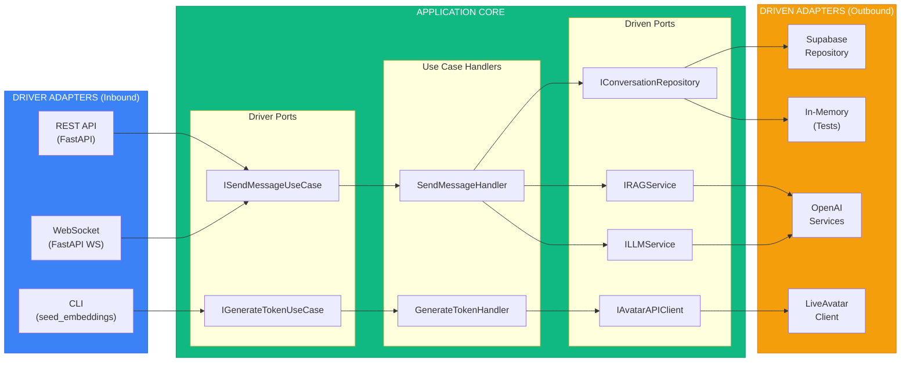

# Portfolio Backend - Technical Architecture Document
## Clean Architecture + DDD + Hexagonal Implementation

**Version:** 1.0  
**Date:** March 16, 2026  
**Related:** [PRD](./portfolio-backend-prd.md)

---

## Table of Contents

1. [Architecture Overview](#architecture-overview)
2. [Domain Layer Design](#domain-layer-design)
3. [Application Layer Design](#application-layer-design)
4. [Infrastructure Layer Design](#infrastructure-layer-design)
5. [Dependency Rules Enforcement](#dependency-rules-enforcement)
6. [Code Examples](#code-examples)
7. [Testing Strategy](#testing-strategy)
8. [Deployment Architecture](#deployment-architecture)

---

## 1. Architecture Overview

### The Three Layers



### Hexagonal View



### Layer Responsibilities

| Layer | Responsibilities | Forbidden Dependencies |
|-------|-----------------|------------------------|
| **Domain** | - Business rules<br>- Entity behavior<br>- Value object validation<br>- Domain events<br>- Repository interfaces (ports) | ❌ FastAPI<br>❌ SQLAlchemy<br>❌ OpenAI SDK<br>❌ Any I/O library |
| **Application** | - Use case orchestration<br>- Transaction boundaries<br>- DTO mapping<br>- Driver/Driven port definitions | ❌ FastAPI<br>❌ Database drivers<br>❌ External API clients |
| **Infrastructure** | - HTTP/WebSocket handling<br>- Database queries<br>- External API calls<br>- Dependency injection<br>- Configuration | ✅ Can import anything |

---

## 2. Domain Layer Design

### Aggregate: Conversation

**Invariants to Protect**:
1. Conversation must have at least one message after starting
2. Messages alternate between user and assistant (except first user message)
3. Session ID is immutable once set
4. Message content cannot be empty
5. Sources are only attached to assistant messages

**Aggregate Structure**:
```
Conversation (Aggregate Root)
├── id: ConversationId (Value Object)
├── sessionId: SessionId (Value Object)
├── messages: List<Message> (Entities, embedded)
├── startedAt: DateTime
├── lastMessageAt: DateTime | null
├── metadata: ConversationMetadata (Value Object)
└── domainEvents: List<DomainEvent>

Message (Entity, part of Conversation)
├── id: MessageId (Value Object)
├── role: MessageRole (Value Object: USER | ASSISTANT)
├── content: MessageContent (Value Object)
├── sources: List<SourceCitation> (Value Objects)
└── createdAt: DateTime
```

**Domain Model** (`src/domain/chatbot/entities/conversation.py`):
```python
from dataclasses import dataclass, field
from datetime import datetime
from typing import List, Optional
from uuid import uuid4

from ..value_objects import ConversationId, SessionId, MessageId, MessageRole, MessageContent, SourceCitation
from ..events import ConversationStarted, MessageSent, ResponseGenerated
from ...shared.base_entity import AggregateRoot
from ...shared.errors import DomainError


@dataclass
class Message:
    """Entity within Conversation aggregate"""
    id: MessageId
    role: MessageRole
    content: MessageContent
    sources: List[SourceCitation] = field(default_factory=list)
    created_at: datetime = field(default_factory=datetime.utcnow)

    @staticmethod
    def create_user_message(content: str) -> "Message":
        return Message(
            id=MessageId.generate(),
            role=MessageRole.USER,
            content=MessageContent.create(content),
            sources=[],
        )

    @staticmethod
    def create_assistant_message(
        content: str, sources: List[SourceCitation]
    ) -> "Message":
        return Message(
            id=MessageId.generate(),
            role=MessageRole.ASSISTANT,
            content=MessageContent.create(content),
            sources=sources,
        )


@dataclass
class Conversation(AggregateRoot[ConversationId]):
    """Aggregate root for chatbot conversation"""
    
    session_id: SessionId
    messages: List[Message] = field(default_factory=list)
    started_at: datetime = field(default_factory=datetime.utcnow)
    last_message_at: Optional[datetime] = None

    @staticmethod
    def create(session_id: SessionId) -> "Conversation":
        """Factory method for new conversations"""
        conversation = Conversation(
            id=ConversationId.generate(),
            session_id=session_id,
            messages=[],
        )
        conversation.add_domain_event(
            ConversationStarted(
                conversation_id=conversation.id,
                session_id=session_id,
                started_at=conversation.started_at,
            )
        )
        return conversation

    def add_user_message(self, content: str) -> MessageId:
        """Add user message to conversation"""
        if not content or not content.strip():
            raise DomainError("Message content cannot be empty")

        message = Message.create_user_message(content)
        self.messages.append(message)
        self.last_message_at = datetime.utcnow()

        self.add_domain_event(
            MessageSent(
                conversation_id=self.id,
                message_id=message.id,
                role=message.role,
                content=message.content,
            )
        )

        return message.id

    def add_assistant_response(
        self, content: str, sources: List[SourceCitation]
    ) -> MessageId:
        """Add assistant response to conversation"""
        if not content or not content.strip():
            raise DomainError("Response content cannot be empty")

        if not self.messages:
            raise DomainError("Cannot add response without prior user message")

        message = Message.create_assistant_message(content, sources)
        self.messages.append(message)
        self.last_message_at = datetime.utcnow()

        self.add_domain_event(
            ResponseGenerated(
                conversation_id=self.id,
                message_id=message.id,
                sources=sources,
            )
        )

        return message.id

    @property
    def message_count(self) -> int:
        return len(self.messages)

    @property
    def last_user_message(self) -> Optional[Message]:
        """Get most recent user message"""
        for message in reversed(self.messages):
            if message.role == MessageRole.USER:
                return message
        return None
```

**Value Objects** (`src/domain/chatbot/value_objects.py`):
```python
from dataclasses import dataclass
from enum import Enum
from uuid import uuid4, UUID
from typing import Any

from ..shared.base_value_object import ValueObject
from ..shared.errors import DomainError


@dataclass(frozen=True)
class ConversationId(ValueObject):
    value: str

    @staticmethod
    def generate() -> "ConversationId":
        return ConversationId(value=f"conv_{uuid4()}")

    @staticmethod
    def from_string(value: str) -> "ConversationId":
        if not value or not value.startswith("conv_"):
            raise DomainError(f"Invalid conversation ID: {value}")
        return ConversationId(value=value)


@dataclass(frozen=True)
class SessionId(ValueObject):
    value: str

    @staticmethod
    def generate() -> "SessionId":
        return SessionId(value=f"sess_{uuid4()}")


@dataclass(frozen=True)
class MessageId(ValueObject):
    value: str

    @staticmethod
    def generate() -> "MessageId":
        return MessageId(value=f"msg_{uuid4()}")


class MessageRole(str, Enum):
    USER = "user"
    ASSISTANT = "assistant"

    @property
    def is_user(self) -> bool:
        return self == MessageRole.USER

    @property
    def is_assistant(self) -> bool:
        return self == MessageRole.ASSISTANT


@dataclass(frozen=True)
class MessageContent(ValueObject):
    text: str

    @staticmethod
    def create(text: str) -> "MessageContent":
        if not text or not text.strip():
            raise DomainError("Message content cannot be empty")
        if len(text) > 1000:
            raise DomainError("Message content exceeds 1000 characters")
        return MessageContent(text=text.strip())

    @property
    def length(self) -> int:
        return len(self.text)


@dataclass(frozen=True)
class SourceCitation(ValueObject):
    """Reference to knowledge base source"""
    source_type: str  # "cv" | "project" | "content"
    source_id: str
    chunk_text: str
    relevance_score: float

    @staticmethod
    def create(
        source_type: str,
        source_id: str,
        chunk_text: str,
        relevance_score: float,
    ) -> "SourceCitation":
        if relevance_score < 0 or relevance_score > 1:
            raise DomainError("Relevance score must be between 0 and 1")
        
        valid_types = ["cv", "project", "content"]
        if source_type not in valid_types:
            raise DomainError(f"Invalid source type: {source_type}")

        return SourceCitation(
            source_type=source_type,
            source_id=source_id,
            chunk_text=chunk_text,
            relevance_score=relevance_score,
        )

    @property
    def is_highly_relevant(self) -> bool:
        return self.relevance_score >= 0.85
```

**Domain Events** (`src/domain/chatbot/events.py`):
```python
from dataclasses import dataclass
from datetime import datetime
from typing import List

from ..value_objects import ConversationId, SessionId, MessageId, MessageRole, MessageContent, SourceCitation
from ...shared.domain_event import DomainEvent


@dataclass(frozen=True)
class ConversationStarted(DomainEvent):
    conversation_id: ConversationId
    session_id: SessionId
    started_at: datetime

    @property
    def event_type(self) -> str:
        return "conversation.started"


@dataclass(frozen=True)
class MessageSent(DomainEvent):
    conversation_id: ConversationId
    message_id: MessageId
    role: MessageRole
    content: MessageContent

    @property
    def event_type(self) -> str:
        return "message.sent"


@dataclass(frozen=True)
class ResponseGenerated(DomainEvent):
    conversation_id: ConversationId
    message_id: MessageId
    sources: List[SourceCitation]

    @property
    def event_type(self) -> str:
        return "response.generated"
```

**Repository Interface (Driven Port)** (`src/domain/chatbot/repository.py`):
```python
from abc import ABC, abstractmethod
from typing import Optional

from .entities.conversation import Conversation
from .value_objects import ConversationId, SessionId


class IConversationRepository(ABC):
    """Repository interface (driven port) for Conversation aggregate"""

    @abstractmethod
    async def find_by_id(self, conversation_id: ConversationId) -> Optional[Conversation]:
        """Retrieve conversation by ID"""
        pass

    @abstractmethod
    async def find_by_session_id(self, session_id: SessionId) -> Optional[Conversation]:
        """Retrieve active conversation for session"""
        pass

    @abstractmethod
    async def save(self, conversation: Conversation) -> None:
        """Persist conversation (insert or update)"""
        pass

    @abstractmethod
    async def delete(self, conversation: Conversation) -> None:
        """Remove conversation"""
        pass
```

### Aggregate: AvatarSession

**Invariants**:
1. Token must be valid (non-empty, proper format)
2. Expiration must be in the future when created
3. IP address is optional but validated if present
4. Session cannot be extended beyond max duration (2 hours)

**Domain Model** (`src/domain/avatar/entities/avatar_session.py`):
```python
from dataclasses import dataclass
from datetime import datetime, timedelta

from ..value_objects import AvatarSessionId, SessionToken, AvatarState
from ...shared.base_entity import AggregateRoot
from ...shared.errors import DomainError


@dataclass
class AvatarSession(AggregateRoot[AvatarSessionId]):
    """Aggregate for LiveAvatar.com session management"""
    
    token: SessionToken
    expires_at: datetime
    ip_address: Optional[str] = None
    current_state: AvatarState = AvatarState.IDLE

    MAX_DURATION_MINUTES = 120  # 2 hours

    @staticmethod
    def create(
        token: str,
        duration_minutes: int,
        ip_address: Optional[str] = None,
    ) -> "AvatarSession":
        """Factory method for new avatar sessions"""
        if duration_minutes > AvatarSession.MAX_DURATION_MINUTES:
            raise DomainError(
                f"Session duration cannot exceed {AvatarSession.MAX_DURATION_MINUTES} minutes"
            )

        session = AvatarSession(
            id=AvatarSessionId.generate(),
            token=SessionToken.from_string(token),
            expires_at=datetime.utcnow() + timedelta(minutes=duration_minutes),
            ip_address=ip_address,
        )

        return session

    def transition_to(self, new_state: AvatarState) -> None:
        """Change avatar state (idle, listening, speaking, thinking)"""
        self.current_state = new_state

    @property
    def is_expired(self) -> bool:
        return datetime.utcnow() >= self.expires_at

    @property
    def time_remaining_seconds(self) -> int:
        if self.is_expired:
            return 0
        delta = self.expires_at - datetime.utcnow()
        return int(delta.total_seconds())
```

---

## 3. Application Layer Design

### Use Case: Send Message

**Flow**:
1. Receive command (conversation ID + message content)
2. Load conversation from repository
3. Add user message to conversation (domain logic)
4. Retrieve context via RAG service (driven port)
5. Generate response via LLM service (driven port)
6. Add assistant response to conversation
7. Save conversation
8. Publish domain events
9. Return response DTO

**Command DTO** (`src/application/chatbot/send_message/command.py`):
```python
from dataclasses import dataclass


@dataclass(frozen=True)
class SendMessageCommand:
    """Command DTO for sending a message"""
    conversation_id: str
    content: str
```

**Response DTO** (`src/application/chatbot/send_message/response.py`):
```python
from dataclasses import dataclass
from datetime import datetime
from typing import List


@dataclass(frozen=True)
class SourceDTO:
    source_type: str
    source_id: str
    chunk_text: str
    relevance_score: float


@dataclass(frozen=True)
class SendMessageResponse:
    message_id: str
    response_content: str
    sources: List[SourceDTO]
    created_at: datetime
```

**Driver Port (Interface)** (`src/application/chatbot/send_message/port.py`):
```python
from abc import ABC, abstractmethod

from .command import SendMessageCommand
from .response import SendMessageResponse


class ISendMessageUseCase(ABC):
    """Driver port for sending messages in chatbot"""

    @abstractmethod
    async def execute(self, command: SendMessageCommand) -> SendMessageResponse:
        pass
```

**Driven Ports (Interfaces)** (`src/application/chatbot/ports/rag_service.py`):
```python
from abc import ABC, abstractmethod
from dataclasses import dataclass
from typing import List


@dataclass
class RetrievedContext:
    chunks: List[str]
    sources: List[dict]


class IRAGService(ABC):
    """Driven port for RAG (Retrieval-Augmented Generation)"""

    @abstractmethod
    async def retrieve_context(
        self, query: str, top_k: int = 5, threshold: float = 0.75
    ) -> RetrievedContext:
        """Retrieve relevant context from knowledge base"""
        pass
```

```python
# src/application/chatbot/ports/llm_service.py
from abc import ABC, abstractmethod
from dataclasses import dataclass
from typing import List


@dataclass
class LLMResponse:
    content: str
    tokens_used: int


class ILLMService(ABC):
    """Driven port for LLM (Large Language Model)"""

    @abstractmethod
    async def generate_response(
        self,
        query: str,
        context_chunks: List[str],
        temperature: float = 0.3,
        max_tokens: int = 500,
    ) -> LLMResponse:
        """Generate response using LLM with retrieved context"""
        pass
```

**Use Case Handler** (`src/application/chatbot/send_message/handler.py`):
```python
from typing import List

from src.domain.chatbot.repository import IConversationRepository
from src.domain.chatbot.value_objects import ConversationId, SourceCitation
from src.domain.shared.errors import DomainError, NotFoundError

from ..ports.rag_service import IRAGService
from ..ports.llm_service import ILLMService
from .command import SendMessageCommand
from .port import ISendMessageUseCase
from .response import SendMessageResponse, SourceDTO


class SendMessageHandler(ISendMessageUseCase):
    """Use case handler for sending messages"""

    def __init__(
        self,
        conversation_repo: IConversationRepository,
        rag_service: IRAGService,
        llm_service: ILLMService,
    ):
        self.conversation_repo = conversation_repo
        self.rag_service = rag_service
        self.llm_service = llm_service

    async def execute(self, command: SendMessageCommand) -> SendMessageResponse:
        # 1. Load conversation
        conversation_id = ConversationId.from_string(command.conversation_id)
        conversation = await self.conversation_repo.find_by_id(conversation_id)

        if not conversation:
            raise NotFoundError(f"Conversation not found: {command.conversation_id}")

        # 2. Add user message (domain logic enforces invariants)
        message_id = conversation.add_user_message(command.content)

        # 3. Retrieve context via RAG
        retrieved = await self.rag_service.retrieve_context(
            query=command.content,
            top_k=5,
            threshold=0.75,
        )

        # 4. Generate response via LLM
        llm_response = await self.llm_service.generate_response(
            query=command.content,
            context_chunks=retrieved.chunks,
            temperature=0.3,
            max_tokens=500,
        )

        # 5. Convert sources to domain value objects
        sources = [
            SourceCitation.create(
                source_type=src["source_type"],
                source_id=src["source_id"],
                chunk_text=src["chunk_text"],
                relevance_score=src["relevance_score"],
            )
            for src in retrieved.sources
        ]

        # 6. Add assistant response to conversation
        response_message_id = conversation.add_assistant_response(
            content=llm_response.content,
            sources=sources,
        )

        # 7. Save conversation (repository handles domain events)
        await self.conversation_repo.save(conversation)

        # 8. Return DTO
        return SendMessageResponse(
            message_id=response_message_id.value,
            response_content=llm_response.content,
            sources=[
                SourceDTO(
                    source_type=src.source_type,
                    source_id=src.source_id,
                    chunk_text=src.chunk_text,
                    relevance_score=src.relevance_score,
                )
                for src in sources
            ],
            created_at=conversation.last_message_at,
        )
```

---

## 4. Infrastructure Layer Design

### REST Controller (Driver Adapter)

**FastAPI Controller** (`src/infrastructure/adapters/driver/rest/chatbot_controller.py`):
```python
from fastapi import APIRouter, Depends, HTTPException
from pydantic import BaseModel

from src.application.chatbot.send_message.command import SendMessageCommand
from src.application.chatbot.send_message.port import ISendMessageUseCase
from src.domain.shared.errors import NotFoundError, DomainError

from ...config.dependencies import get_send_message_use_case


router = APIRouter(prefix="/api/chat", tags=["chatbot"])


class SendMessageRequest(BaseModel):
    content: str


class SendMessageResponseModel(BaseModel):
    message_id: str
    response_content: str
    sources: list
    created_at: str


@router.post(
    "/conversations/{conversation_id}/messages",
    response_model=SendMessageResponseModel,
)
async def send_message(
    conversation_id: str,
    request: SendMessageRequest,
    use_case: ISendMessageUseCase = Depends(get_send_message_use_case),
):
    """Send a message in a conversation"""
    try:
        command = SendMessageCommand(
            conversation_id=conversation_id,
            content=request.content,
        )

        response = await use_case.execute(command)

        return SendMessageResponseModel(
            message_id=response.message_id,
            response_content=response.response_content,
            sources=[
                {
                    "source_type": src.source_type,
                    "source_id": src.source_id,
                    "chunk_text": src.chunk_text,
                    "relevance_score": src.relevance_score,
                }
                for src in response.sources
            ],
            created_at=response.created_at.isoformat(),
        )

    except NotFoundError as e:
        raise HTTPException(status_code=404, detail=str(e))
    except DomainError as e:
        raise HTTPException(status_code=400, detail=str(e))
    except Exception as e:
        raise HTTPException(status_code=500, detail="Internal server error")
```

### Repository Implementation (Driven Adapter)

**Supabase Repository** (`src/infrastructure/adapters/driven/supabase/conversation_repository.py`):
```python
from typing import Optional
from supabase import Client

from src.domain.chatbot.repository import IConversationRepository
from src.domain.chatbot.entities.conversation import Conversation, Message
from src.domain.chatbot.value_objects import ConversationId, SessionId, MessageId, MessageRole

from .mappers import ConversationMapper


class SupabaseConversationRepository(IConversationRepository):
    """Driven adapter implementing conversation repository with Supabase"""

    def __init__(self, client: Client):
        self.client = client

    async def find_by_id(self, conversation_id: ConversationId) -> Optional[Conversation]:
        # Query conversations table
        result = (
            self.client.table("conversations")
            .select("*, messages(*)")
            .eq("id", conversation_id.value)
            .single()
            .execute()
        )

        if not result.data:
            return None

        # Map database row to domain aggregate
        return ConversationMapper.to_domain(result.data)

    async def find_by_session_id(self, session_id: SessionId) -> Optional[Conversation]:
        result = (
            self.client.table("conversations")
            .select("*, messages(*)")
            .eq("session_id", session_id.value)
            .order("started_at", desc=True)
            .limit(1)
            .execute()
        )

        if not result.data:
            return None

        return ConversationMapper.to_domain(result.data[0])

    async def save(self, conversation: Conversation) -> None:
        # Map domain aggregate to database format
        persistence_data = ConversationMapper.to_persistence(conversation)

        # Upsert conversation
        self.client.table("conversations").upsert(
            persistence_data["conversation"]
        ).execute()

        # Upsert messages
        for message_data in persistence_data["messages"]:
            self.client.table("messages").upsert(message_data).execute()

        # Publish domain events (future: use outbox pattern)
        # for event in conversation.domain_events:
        #     await self.event_publisher.publish(event)

        conversation.clear_domain_events()

    async def delete(self, conversation: Conversation) -> None:
        self.client.table("conversations").delete().eq(
            "id", conversation.id.value
        ).execute()
```

**Mapper** (`src/infrastructure/adapters/driven/supabase/mappers.py`):
```python
from typing import Dict, Any, List

from src.domain.chatbot.entities.conversation import Conversation, Message
from src.domain.chatbot.value_objects import (
    ConversationId,
    SessionId,
    MessageId,
    MessageRole,
    MessageContent,
    SourceCitation,
)


class ConversationMapper:
    """Maps between domain models and database persistence"""

    @staticmethod
    def to_domain(data: Dict[str, Any]) -> Conversation:
        """Convert database row to domain aggregate"""
        messages = [
            Message(
                id=MessageId(value=msg["id"]),
                role=MessageRole(msg["role"]),
                content=MessageContent(text=msg["content"]),
                sources=[
                    SourceCitation(
                        source_type=src["source_type"],
                        source_id=src["source_id"],
                        chunk_text=src["chunk_text"],
                        relevance_score=src["relevance_score"],
                    )
                    for src in msg.get("sources", [])
                ],
                created_at=msg["created_at"],
            )
            for msg in data.get("messages", [])
        ]

        return Conversation(
            id=ConversationId(value=data["id"]),
            session_id=SessionId(value=data["session_id"]),
            messages=messages,
            started_at=data["started_at"],
            last_message_at=data.get("last_message_at"),
        )

    @staticmethod
    def to_persistence(conversation: Conversation) -> Dict[str, Any]:
        """Convert domain aggregate to database format"""
        return {
            "conversation": {
                "id": conversation.id.value,
                "session_id": conversation.session_id.value,
                "started_at": conversation.started_at.isoformat(),
                "last_message_at": (
                    conversation.last_message_at.isoformat()
                    if conversation.last_message_at
                    else None
                ),
            },
            "messages": [
                {
                    "id": msg.id.value,
                    "conversation_id": conversation.id.value,
                    "role": msg.role.value,
                    "content": msg.content.text,
                    "sources": [
                        {
                            "source_type": src.source_type,
                            "source_id": src.source_id,
                            "chunk_text": src.chunk_text,
                            "relevance_score": src.relevance_score,
                        }
                        for src in msg.sources
                    ],
                    "created_at": msg.created_at.isoformat(),
                }
                for msg in conversation.messages
            ],
        }
```

### OpenAI Service (Driven Adapter)

**LLM Service** (`src/infrastructure/adapters/driven/openai/llm_service.py`):
```python
from typing import List
import openai

from src.application.chatbot.ports.llm_service import ILLMService, LLMResponse


class OpenAILLMService(ILLMService):
    """Driven adapter for OpenAI LLM"""

    def __init__(self, api_key: str, model: str = "gpt-4o-mini"):
        self.client = openai.AsyncOpenAI(api_key=api_key)
        self.model = model

    async def generate_response(
        self,
        query: str,
        context_chunks: List[str],
        temperature: float = 0.3,
        max_tokens: int = 500,
    ) -> LLMResponse:
        # Build system prompt with context
        context_text = "\n\n".join(context_chunks)
        system_prompt = f"""You are an AI assistant representing Richard Xavier Ayala Funes, a Backend and AI Engineer.
Answer questions about his professional background, projects, and technical expertise.

Context from knowledge base:
{context_text}

Rules:
- Always cite sources (e.g., "In his role at Purrfect Hire...")
- If uncertain, say "I don't have information about that"
- Keep responses concise (2-3 paragraphs max)
- Use technical terminology appropriate for the audience"""

        # Call OpenAI API
        response = await self.client.chat.completions.create(
            model=self.model,
            messages=[
                {"role": "system", "content": system_prompt},
                {"role": "user", "content": query},
            ],
            temperature=temperature,
            max_tokens=max_tokens,
        )

        return LLMResponse(
            content=response.choices[0].message.content,
            tokens_used=response.usage.total_tokens,
        )
```

### Dependency Injection

**Container** (`src/infrastructure/config/dependencies.py`):
```python
from functools import lru_cache
from supabase import create_client, Client

from src.application.chatbot.send_message.handler import SendMessageHandler
from src.application.chatbot.send_message.port import ISendMessageUseCase
from src.infrastructure.adapters.driven.supabase.conversation_repository import (
    SupabaseConversationRepository,
)
from src.infrastructure.adapters.driven.openai.rag_service import OpenAIRAGService
from src.infrastructure.adapters.driven.openai.llm_service import OpenAILLMService

from .settings import get_settings


@lru_cache()
def get_supabase_client() -> Client:
    settings = get_settings()
    return create_client(settings.SUPABASE_URL, settings.SUPABASE_KEY)


def get_send_message_use_case() -> ISendMessageUseCase:
    """Composition root for dependency injection"""
    settings = get_settings()
    
    # Driven adapters
    supabase_client = get_supabase_client()
    conversation_repo = SupabaseConversationRepository(supabase_client)
    rag_service = OpenAIRAGService(
        api_key=settings.OPENAI_API_KEY,
        vector_store_client=supabase_client,
    )
    llm_service = OpenAILLMService(api_key=settings.OPENAI_API_KEY)

    # Application handler
    return SendMessageHandler(
        conversation_repo=conversation_repo,
        rag_service=rag_service,
        llm_service=llm_service,
    )
```

---

## 5. Dependency Rules Enforcement

### Architecture Tests

**Test Suite** (`tests/architecture/test_dependency_rules.py`):
```python
import ast
import os
from pathlib import Path


def get_imports_from_file(filepath: Path) -> set:
    """Extract all imports from a Python file"""
    with open(filepath) as f:
        tree = ast.parse(f.read())

    imports = set()
    for node in ast.walk(tree):
        if isinstance(node, ast.Import):
            for alias in node.names:
                imports.add(alias.name.split(".")[0])
        elif isinstance(node, ast.ImportFrom):
            if node.module:
                imports.add(node.module.split(".")[0])

    return imports


def get_all_files_in_layer(layer: str) -> list:
    """Get all Python files in a layer"""
    base = Path("src") / layer
    return list(base.rglob("*.py"))


def test_domain_has_no_infrastructure_dependencies():
    """Domain layer must NOT import from infrastructure"""
    domain_files = get_all_files_in_layer("domain")
    
    for filepath in domain_files:
        imports = get_imports_from_file(filepath)
        
        forbidden = {"fastapi", "supabase", "openai", "sqlalchemy", "pydantic"}
        violations = imports & forbidden
        
        assert not violations, (
            f"{filepath} imports forbidden infrastructure: {violations}"
        )


def test_domain_has_no_application_dependencies():
    """Domain layer must NOT import from application"""
    domain_files = get_all_files_in_layer("domain")
    
    for filepath in domain_files:
        imports = get_imports_from_file(filepath)
        
        # Check for application layer imports
        assert "application" not in str(filepath), (
            f"{filepath} imports from application layer"
        )


def test_application_has_no_infrastructure_dependencies():
    """Application layer must NOT import from infrastructure"""
    app_files = get_all_files_in_layer("application")
    
    for filepath in app_files:
        imports = get_imports_from_file(filepath)
        
        forbidden = {"fastapi", "supabase", "openai"}
        violations = imports & forbidden
        
        assert not violations, (
            f"{filepath} imports forbidden infrastructure: {violations}"
        )
```

---

## 6. Code Examples

### Complete Use Case Flow (Integration Test)

**Test** (`tests/integration/test_send_message_flow.py`):
```python
import pytest
from src.domain.chatbot.entities.conversation import Conversation
from src.domain.chatbot.value_objects import SessionId
from src.application.chatbot.send_message.command import SendMessageCommand
from src.application.chatbot.send_message.handler import SendMessageHandler
from src.infrastructure.adapters.driven.in_memory.conversation_repository import (
    InMemoryConversationRepository,
)
from src.infrastructure.adapters.driven.in_memory.fake_rag_service import FakeRAGService
from src.infrastructure.adapters.driven.in_memory.fake_llm_service import FakeLLMService


@pytest.mark.asyncio
async def test_send_message_complete_flow():
    """Integration test for send message use case"""
    
    # Arrange: Setup dependencies
    repo = InMemoryConversationRepository()
    rag = FakeRAGService(
        mock_chunks=["Richard worked at Purrfect Hire from May 2025"],
        mock_sources=[
            {
                "source_type": "cv",
                "source_id": "purrfect_hire",
                "chunk_text": "Richard worked at Purrfect Hire...",
                "relevance_score": 0.95,
            }
        ],
    )
    llm = FakeLLMService(
        mock_response="Richard worked at Purrfect Hire as Technical Lead from May 2025."
    )
    
    # Create initial conversation
    conversation = Conversation.create(SessionId.generate())
    await repo.save(conversation)
    
    # Initialize handler
    handler = SendMessageHandler(
        conversation_repo=repo,
        rag_service=rag,
        llm_service=llm,
    )
    
    # Act: Send message
    command = SendMessageCommand(
        conversation_id=conversation.id.value,
        content="Where did Richard work most recently?",
    )
    
    response = await handler.execute(command)
    
    # Assert: Verify response
    assert "Purrfect Hire" in response.response_content
    assert len(response.sources) == 1
    assert response.sources[0].source_type == "cv"
    assert response.sources[0].relevance_score == 0.95
    
    # Verify conversation state
    updated_conversation = await repo.find_by_id(conversation.id)
    assert updated_conversation.message_count == 2  # User + Assistant
    assert updated_conversation.last_user_message.content.text == command.content
```

---

## 7. Testing Strategy

### Test Pyramid

```
                 /\
                /  \
               / E2E\          5% - End-to-End (via API)
              /______\
             /        \
            / Integr.  \       15% - Integration (layers together)
           /____________\
          /              \
         /  Unit Tests    \    80% - Unit (domain + application)
        /__________________\
```

**Test Distribution**:
- **Unit Tests (80%)**: Domain entities, value objects, use case handlers (with mocks)
- **Integration Tests (15%)**: Repository implementations, external API clients
- **E2E Tests (5%)**: Full API flow with test database

### Test Doubles

**In-Memory Repository** (for fast unit tests):
```python
# src/infrastructure/adapters/driven/in_memory/conversation_repository.py
from typing import Dict, Optional

from src.domain.chatbot.repository import IConversationRepository
from src.domain.chatbot.entities.conversation import Conversation
from src.domain.chatbot.value_objects import ConversationId, SessionId


class InMemoryConversationRepository(IConversationRepository):
    """Test double for conversation repository"""

    def __init__(self):
        self._conversations: Dict[str, Conversation] = {}

    async def find_by_id(self, conversation_id: ConversationId) -> Optional[Conversation]:
        return self._conversations.get(conversation_id.value)

    async def find_by_session_id(self, session_id: SessionId) -> Optional[Conversation]:
        for conv in self._conversations.values():
            if conv.session_id.value == session_id.value:
                return conv
        return None

    async def save(self, conversation: Conversation) -> None:
        self._conversations[conversation.id.value] = conversation
        conversation.clear_domain_events()

    async def delete(self, conversation: Conversation) -> None:
        self._conversations.pop(conversation.id.value, None)

    def clear(self):
        """Test helper"""
        self._conversations.clear()
```

---

## 8. Deployment Architecture

### Digital Ocean Setup

**Infrastructure**:
- 1x Droplet (2GB RAM, $12/month): Runs Docker Compose
- Supabase (managed PostgreSQL): Free tier
- GitHub Actions (CI/CD): Free for public repos

**Docker Compose** (`docker-compose.yml`):
```yaml
version: '3.8'

services:
  backend:
    build:
      context: .
      dockerfile: Dockerfile
    ports:
      - "8000:8000"
    environment:
      - DATABASE_URL=${DATABASE_URL}
      - OPENAI_API_KEY=${OPENAI_API_KEY}
      - LIVEAVATAR_API_KEY=${LIVEAVATAR_API_KEY}
      - SUPABASE_URL=${SUPABASE_URL}
      - SUPABASE_KEY=${SUPABASE_KEY}
      - SENTRY_DSN=${SENTRY_DSN}
      - ENVIRONMENT=production
    restart: unless-stopped
    healthcheck:
      test: ["CMD", "curl", "-f", "http://localhost:8000/health"]
      interval: 30s
      timeout: 10s
      retries: 3

  nginx:
    image: nginx:alpine
    ports:
      - "80:80"
      - "443:443"
    volumes:
      - ./nginx.conf:/etc/nginx/nginx.conf
      - ./ssl:/etc/nginx/ssl
    depends_on:
      - backend
    restart: unless-stopped
```

**GitHub Actions Deployment** (`.github/workflows/deploy.yml`):
```yaml
name: Deploy to Production

on:
  push:
    branches: [main]

jobs:
  deploy:
    runs-on: ubuntu-latest
    steps:
      - uses: actions/checkout@v3

      - name: Build Docker image
        run: docker build -t portfolio-backend:${{ github.sha }} .

      - name: Save Docker image
        run: docker save portfolio-backend:${{ github.sha }} | gzip > image.tar.gz

      - name: Copy to server
        uses: appleboy/scp-action@master
        with:
          host: ${{ secrets.DO_SERVER_IP }}
          username: deploy
          key: ${{ secrets.SSH_PRIVATE_KEY }}
          source: "image.tar.gz,docker-compose.yml"
          target: "/home/deploy/portfolio-backend"

      - name: Deploy
        uses: appleboy/ssh-action@master
        with:
          host: ${{ secrets.DO_SERVER_IP }}
          username: deploy
          key: ${{ secrets.SSH_PRIVATE_KEY }}
          script: |
            cd /home/deploy/portfolio-backend
            docker load < image.tar.gz
            docker-compose up -d --no-deps backend
            docker image prune -f
```

---

**END OF ARCHITECTURE DOCUMENT**

**Next Steps**:
1. Review architecture patterns and validate against requirements
2. Set up project repository with folder structure
3. Implement domain layer (pure business logic, no dependencies)
4. Add application layer (use cases with port interfaces)
5. Implement infrastructure adapters (FastAPI, Supabase, OpenAI)
6. Write tests (unit → integration → e2e)
7. Configure CI/CD and deploy to Digital Ocean
